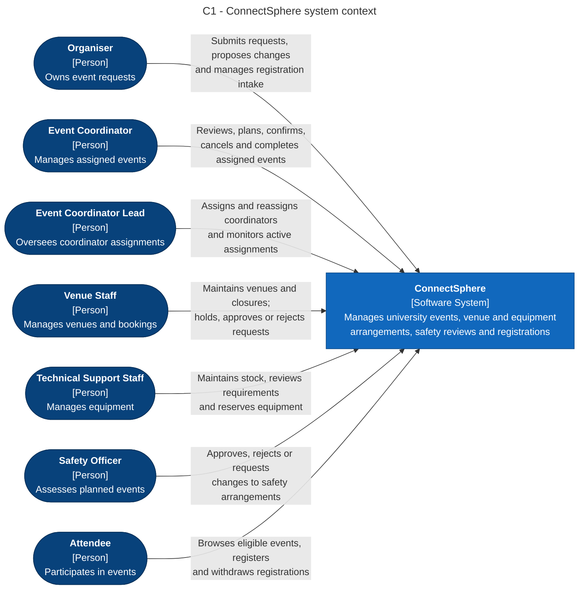

# C1: ConnectSphere

```mermaid
---
title: C1 - ConnectSphere system context
config:
  flowchart:
    wrappingWidth: 360
---
flowchart LR
  organiser(["<b>Organiser</b><br/>[Person]<br/>Owns event requests"])
  coordinator(["<b>Event Coordinator</b><br/>[Person]<br/>Manages assigned events"])
  lead(["<b>Event Coordinator Lead</b><br/>[Person]<br/>Oversees coordinator assignments"])
  venue_staff(["<b>Venue Staff</b><br/>[Person]<br/>Manages venues and bookings"])
  tech(["<b>Technical Support Staff</b><br/>[Person]<br/>Manages equipment"])
  safety(["<b>Safety Officer</b><br/>[Person]<br/>Assesses planned events"])
  attendee(["<b>Attendee</b><br/>[Person]<br/>Participates in events"])

  connectsphere["<b>ConnectSphere</b><br/>[Software System]<br/>Manages university events, venue and equipment<br/>arrangements, safety reviews and registrations"]

  organiser -->|Submits requests, proposes changes<br/>and manages registration intake| connectsphere
  coordinator -->|Reviews, plans, confirms,<br/>cancels and completes assigned events| connectsphere
  lead -->|Assigns and reassigns coordinators<br/>and monitors active assignments| connectsphere
  venue_staff -->|Maintains venues and closures;<br/>holds, approves or rejects requests| connectsphere
  tech -->|Maintains stock, reviews requirements<br/>and reserves equipment| connectsphere
  safety -->|Approves, rejects or requests<br/>changes to safety arrangements| connectsphere
  attendee -->|Browses eligible events, registers<br/>and withdraws registrations| connectsphere

  classDef person fill:#08427b,color:#fff,stroke:#052e56
  classDef system fill:#1168bd,color:#fff,stroke:#0b4884
  class organiser,coordinator,lead,venue_staff,tech,safety,attendee person
  class connectsphere system
```