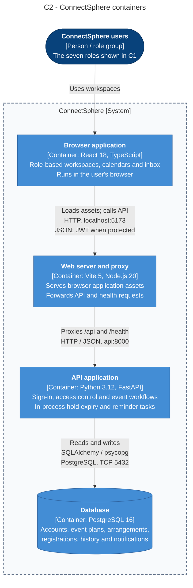

# C2: ConnectSphere

```mermaid
---
title: C2 - ConnectSphere containers
config:
  flowchart:
    wrappingWidth: 360
    rankSpacing: 100
    subGraphTitleMargin:
      top: 8
      bottom: 20
---
flowchart TB
  users(["<b>ConnectSphere users</b><br/>[Person / role group]<br/>The seven roles shown in C1"])

  subgraph connectsphere["ConnectSphere [System]"]
    direction TB
    spa["<b>Browser application</b><br/>[Container: React 18, TypeScript]<br/>Role-based workspaces, calendars and inbox<br/>Runs in the user's browser"]
    web["<b>Web server and proxy</b><br/>[Container: Vite 5, Node.js 20]<br/>Serves browser application assets<br/>Forwards API and health requests"]
    api["<b>API application</b><br/>[Container: Python 3.12, FastAPI]<br/>Sign-in, access control and event workflows<br/>In-process hold expiry and reminder tasks"]
    db[("<b>Database</b><br/>[Container: PostgreSQL 16]<br/>Accounts, event plans, arrangements,<br/>registrations, history and notifications")]

    spa -->|Loads assets; calls API<br/>HTTP, localhost:5173<br/>JSON; JWT when protected| web
    web -->|Proxies /api and /health<br/>HTTP / JSON, api:8000| api
    api -->|Reads and writes<br/>SQLAlchemy / psycopg<br/>PostgreSQL, TCP 5432| db
  end

  users -->|Uses workspaces| spa

  classDef person fill:#08427b,color:#fff,stroke:#052e56
  classDef container fill:#438dd5,color:#fff,stroke:#2e629e
  class users person
  class spa,web,api,db container
  style connectsphere fill:#f8fafc,stroke:#64748b,stroke-width:2px,stroke-dasharray:6 4
```