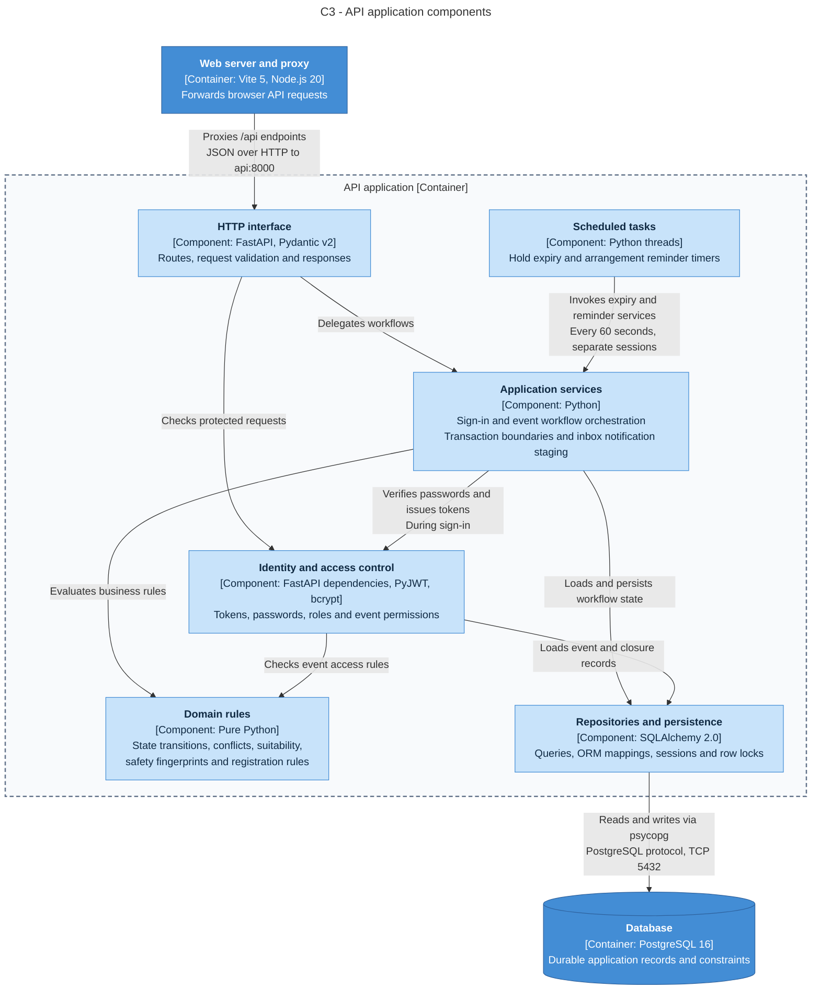

# C3: ConnectSphere

```mermaid
---
title: C3 - API application components
config:
  flowchart:
    wrappingWidth: 360
    subGraphTitleMargin:
      top: 8
      bottom: 20
---
flowchart TB
  web["<b>Web server and proxy</b><br/>[Container: Vite 5, Node.js 20]<br/>Forwards browser API requests"]

  subgraph api["API application [Container]"]
    direction TB
    http["<b>HTTP interface</b><br/>[Component: FastAPI, Pydantic v2]<br/>Routes, request validation and responses"]
    timers["<b>Scheduled tasks</b><br/>[Component: Python threads]<br/>Hold expiry and arrangement reminder timers"]
    services["<b>Application services</b><br/>[Component: Python]<br/>Sign-in and event workflow orchestration<br/>Transaction boundaries and inbox notification staging"]
    access["<b>Identity and access control</b><br/>[Component: FastAPI dependencies, PyJWT, bcrypt]<br/>Tokens, passwords, roles and event permissions"]
    rules["<b>Domain rules</b><br/>[Component: Pure Python]<br/>State transitions, conflicts, suitability,<br/>safety fingerprints and registration rules"]
    persistence["<b>Repositories and persistence</b><br/>[Component: SQLAlchemy 2.0]<br/>Queries, ORM mappings, sessions and row locks"]

    http -->|Delegates workflows| services
    http -->|Checks protected requests| access
    timers -->|Invokes expiry and reminder services<br/>Every 60 seconds, separate sessions| services
    services -->|Verifies passwords and issues tokens<br/>During sign-in| access
    services -->|Evaluates business rules| rules
    services -->|Loads and persists workflow state| persistence
    access -->|Checks event access rules| rules
    access -->|Loads event and closure records| persistence
  end

  db[("<b>Database</b><br/>[Container: PostgreSQL 16]<br/>Durable application records and constraints")]
  web -->|Proxies /api endpoints<br/>JSON over HTTP to api:8000| http
  persistence -->|Reads and writes via psycopg<br/>PostgreSQL protocol, TCP 5432| db

  classDef container fill:#438dd5,color:#fff,stroke:#2e629e
  classDef component fill:#c8e3fa,color:#102a43,stroke:#438dd5
  class web,db container
  class http,timers,services,access,rules,persistence component
  style api fill:#f8fafc,stroke:#64748b,stroke-width:2px,stroke-dasharray:6 4
```